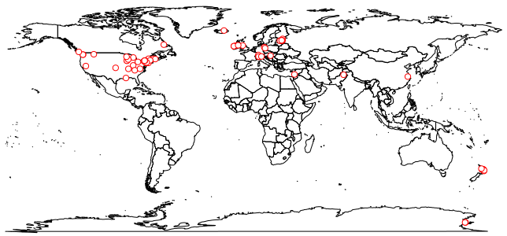
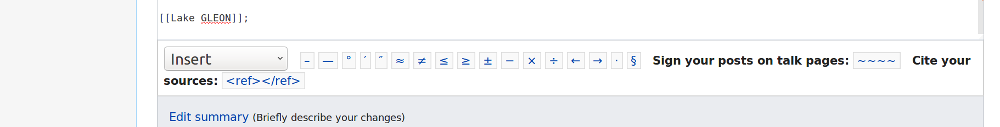
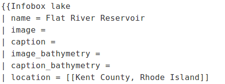
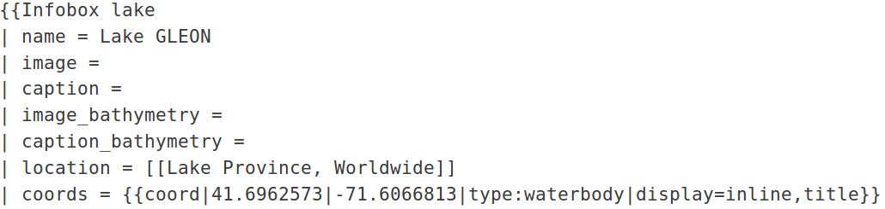

## About

Here is a map of GLEON lakes according to Wikipedia:



According to [one analysis](https://gist.github.com/jsta/e486f337be6d5bcdb3aeb1335959de52) over 100 GLEON lakes are missing a Wikipedia page. This guide is designed to serve as a guide for GLEON members whose lake lacks a page on Wikipedia. Before you begin, you should sign up for a Wikipedia account by navigating to [https://en.wikipedia.org/](https://en.wikipedia.org/), clicking on `Log in`, and clicking on `Join Wikipedia`.

### Create a blank page

The first step in creating a page is to make sure it does not already exist. The next step is to create a blank page. Although, you have [several options](https://en.wikipedia.org/wiki/Wikipedia:How_to_create_a_page), the easiest method involves creating a "broken" link on your user talk page:

> Your user talk page can be accessed by navigating to your user profile, which is done by clicking your user name in the middle of the page at the very top (assuming you have logged in), switching to the `Talk` tab, and clicking `Edit source`. You can create the necessary broken link using bracket syntax. For example, if our lake is called `Lake GLEON` the link will be:



After clicking the `Save changes` button, the link will appear in red text (indicating the page does not exist). Following the broken link will create a blank Wikipedia page at the appropriate address.


### Copy over template

The next step is to copy over the [Wikitext](https://en.wikipedia.org/wiki/Help:Wikitext) from an existing lake page. You can find some existing lake pages through the [Wikiproject Lakes](https://en.wikipedia.org/wiki/Wikipedia:WikiProject_Lakes) or [GLEON](https://en.wikipedia.org/wiki/Global_Lake_Ecological_Observatory_Network) pages. This can be a bit overwhelming for lakes with a lot of existing information such as [Lake Rotorua](https://en.wikipedia.org/wiki/Lake_Rotorua). Sometimes it is easier to start with a page with minimal information such as [Flat River Reservoir](https://en.wikipedia.org/wiki/Flat_River_Reservoir).

Let's copy over the [Wikitext](https://en.wikipedia.org/wiki/Help:Wikitext) from [Flat River Reservoir](https://en.wikipedia.org/wiki/Flat_River_Reservoir) by opening the page in a new browser tab, navigating to the `Edit source` tab, copying the Wikitext, and pasting it into our new page.

### Replace items

Now we can start replacing the items left over from the Flat River Reservoir page with the corresponding information for our target lake (Lake GLEON). In our example we would replace the original text for Flat River Reservoir with the corresponding information from Lake GLEON:



Notice that many of the items are blank and can be left blank. A few of the items are critical including the `name`, `location`, and `coords` fields.



### Cite references

If you have additional information on the characteristics of the lake such as depth, area, or any of the other fields in the [Infobox template](https://en.wikipedia.org/wiki/Template:Infobox_body_of_water) they should be cited with reference tags whenever possible. 

For example, lets say we know that the maximum depth of Lake GLEON according to the Lake GLEON water authority is 10 meters. We can add this information to the page along with a citation using the following Wikitext markup:


```
| max-depth = {{Convert|32|ft|m|0|abbr=on}}<ref name="lakegleonwater">Lake GLEON water authority <http://lakegleon.org/lake_gleon></ref>
```


### Preview changes and save

Before saving changes you should click the `Show Preview` button. If everything looks good click `Save changes`.


