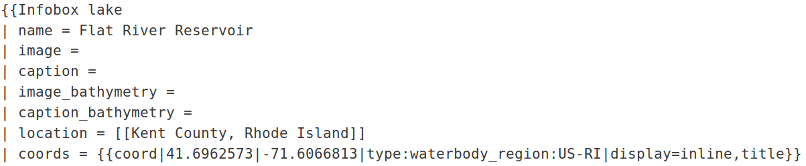

## About

This guide is designed to serve as a guide for GLEON members whose lake lacks a page on Wikipedia. Before you begin, you should sign up for a Wikipedia account by navigating to [https://en.wikipedia.org/](https://en.wikipedia.org/), clicking on `Log in`, and clicking on `Join Wikipedia`.

### Create a blank page

The first step in creating a page is to make sure it does not already exist. Assuming that it does not the next step is to create a blank page. Although, you have [several options](https://en.wikipedia.org/wiki/Wikipedia:How_to_create_a_page), the easiest method involves creating a broken link on your user talk page:

> This can be accessed by navigating to your user profile, which is done by clicking your user name in the middle of the page at the very top (assuming you have logged in), switching to the `Talk` tab, and clicking `Edit source`. You can create the necessary broken link using bracket syntax. For example, if our lake is called `Lake GLEON` the link will be:

After clicking the `Save changes` button, the link will appear in red text (indicating the page does not exist).

### Copy over template

Following the broken link will create a blank Wikipedia page at the appropriate address. The next step is to copy over the [Wikitext](https://en.wikipedia.org/wiki/Help:Wikitext) from an existing lake page. You can find some existing lake pages through the [Wikiproject Lakes](https://en.wikipedia.org/wiki/Wikipedia:WikiProject_Lakes) or [GLEON](https://en.wikipedia.org/wiki/Global_Lake_Ecological_Observatory_Network) pages. This can be a bit overwhelming for lakes with a lot of existing information such as [Lake Rotorua](https://en.wikipedia.org/wiki/Lake_Rotorua). Sometimes it is easier to start with a page with minimal information such as [Flat River Reservoir](https://en.wikipedia.org/wiki/Flat_River_Reservoir).

Let's copy over the [Wikitext](https://en.wikipedia.org/wiki/Help:Wikitext) from [Flat River Reservoir](https://en.wikipedia.org/wiki/Flat_River_Reservoir) by opening the page in a new browser tab, navigating to the `Edit source` tab, copying the Wikitext, and pasting it into our new page.

### Replace items

Now we can start replacing the items left over from the Flat River Reservoir page with the corresponding information for our target lake (Lake GLEON). 

Many of the items are blank and can be left blank. However, a few of the items are critical. These include the `name`, `location`, and `coords` fields.

#### Add pushpin map

Filling out the `pushpin_map` field is a nice touch as visitors to the page can visualize the lake's location.

### Cite references

Information on the characteristics of the lake should be cited with referencs whenever possible. This can be done with `ref` `html` tags. For example, on the Flat River Reservoir page the maximum lake depth value is cited from a website between an opening and closing `ref` tag:

